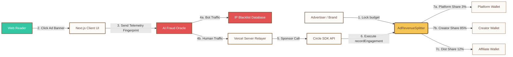
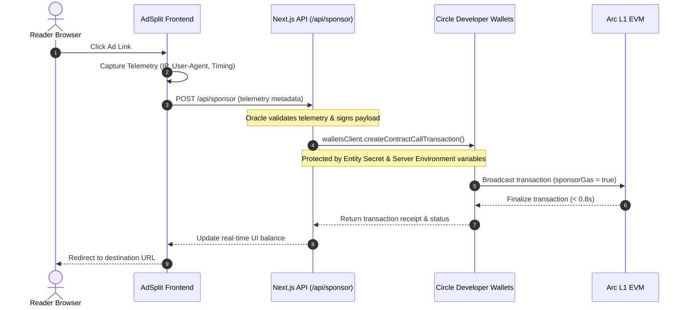
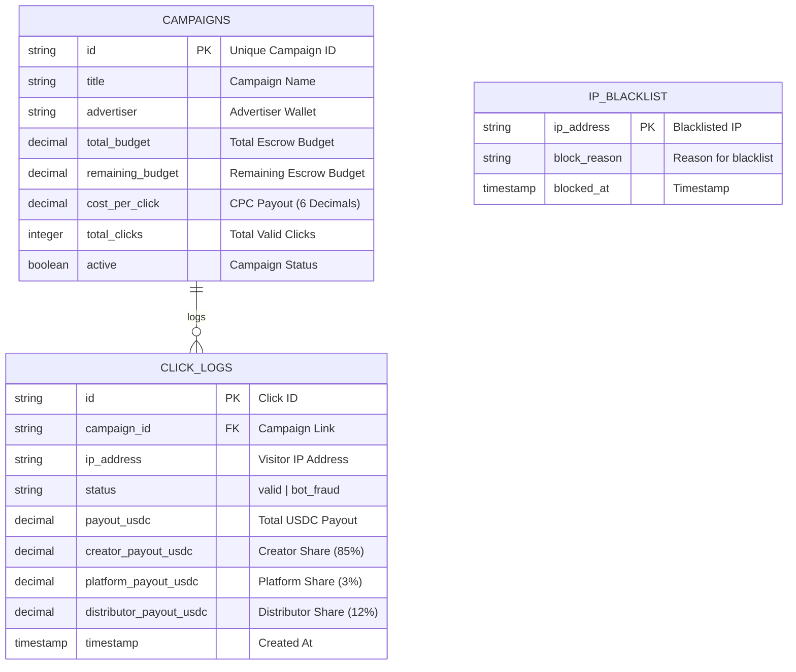
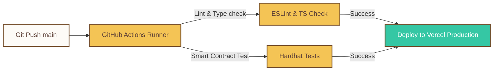

# AdSplit 🪙

> **A Next-Generation Decentralized Digital Advertising Network & On-Chain Revenue Distribution Protocol**  
> Deployed natively on **Arc L1 Network** powered by **Circle Programmable Wallets** and **Supabase Realtime Sync**.

[](https://testnet.arc.network)
[](https://nextjs.org)
[](https://soliditylang.org)
[](https://www.circle.com)
[](https://supabase.com)
[](https://opensource.org/licenses/MIT)


---

## 1. Platform Vision & Philosophy

### Core Problem Solved
Traditional digital advertising networks (e.g., Google AdSense, Meta Ads) act as highly extractive, black-box middlemen. Creators are forced to accept **Net-30 or Net-45 settlement periods** with high payout thresholds ($100+), while middleman platforms capture between **32% to 49%** of ad spends to offset manual reconciliation and bot validation costs. Furthermore, advertisers lose billions annually to click-fraud botnets with no cryptographic audit trail to verify actual human engagement.

### The AdSplit Alternative
AdSplit introduces a programmatic, trustless, pay-per-click ad distribution ledger. By uniting **USDC as the native gas token of Arc L1** with **Circle's Programmable Wallets**, AdSplit locks advertising budgets in decentralized smart-contract escrows. Legitimate ad engagements are validated off-chain via real-time client telemetry analysis, immediately triggering on-chain revenue splits: **85% to Content Creators, 10% to Affiliates/Distributors, and 5% to the Platform** in less than **0.8 seconds** with a completely **gasless user experience**.

### System Architecture Rationale
Our architecture adopts a hybrid Web3-SaaS approach:
* **Off-chain High Performance:** Real-time user telemetry evaluation and anti-bot validation are processed by edge functions to maintain sub-100ms response times.
* **On-chain Absolute Integrity:** Escrow lockups and revenue distribution are hardcoded in Solidity smart contracts, ensuring advertisers pay only for validated human clicks.

---

## 2. Capabilities & Core Modules

* **Escrow-Backed Advertising Campaigns:** Deploys secure public contracts that lock budgets in USDC. Advertisers can pause campaigns and instantly reclaim remaining balances via `withdrawRemainingBudget`.
* **Programmatic Payout Settlements:** Splits every single valid click payout on-chain in real-time, eliminating payment cycles and establishing high liquidity for publishers.
* **Circle CCTP Sweeper Integration:** Bridges stablecoins (USDC/EURC) directly from alternative networks like Ethereum Sepolia or Solana Devnet using **Circle's Cross-Chain Transfer Protocol (CCTP)**.
* **Cognitive Telemetry Filtering:** Employs an off-chain Oracle node that scores visitor browser parameters to shield advertisers' budgets from automated bot floods.
* **Sponsor Gasless Relayer:** Leverages Circle's Developer-Controlled Wallets API to sponsor contract call transaction gas fees, offering publishers a frictionless Web2 onboarding experience.

---

## 3. Platform Topology & Technical Blueprint

AdSplit is built as a **Modular Monolith** using **Next.js 15 (App Router)**. This keeps deployment overhead extremely low for agile engineering teams while keeping domains structurally isolated for future microservice extraction.

```
┌────────────────────────────────────────────────────────┐
│               ADSPLIT MODULAR MONOLITH                 │
│                                                        │
│   ┌───────────────┐ ┌───────────────┐ ┌────────────┐   │
│   │ Advertiser    │ │ Creator       │ │ AI Oracle  │   │
│   │ Domain        │ │ Domain        │ │ Domain     │   │
│   └───────┬───────┘ └───────┬───────┘ └─────┬──────┘   │
└───────────┼─────────────────┼───────────────┼──────────┘
            ▼                 ▼               ▼
┌────────────────────────────────────────────────────────┐
│                      Next.js API                       │
│        (Secure Relayer /api/sponsor & Webhooks)        │
└───────────┬─────────────────┬───────────────┬──────────┘
            ▼                 ▼               ▼
┌──────────────────┐ ┌────────────────┐ ┌────────────────┐
│   Circle DCW     │ │    Supabase    │ │ Arc L1 Chain   │
│   (Wallet API)   │ │  (Postgres DB) │ │ (Solidity EVM) │
└──────────────────┘ └────────────────┘ └────────────────┘
```

### Domain Boundaries & Service Responsibilities
1. **Advertiser Hub:** Coordinates USDC escrow lockups, active budget parameters, campaign statistics, and real-time conversion metrics.
2. **Creator Registry:** Handles embedded developer-controlled wallet creation, payout allocations, and domain statistics.
3. **AI-Telemetry Oracle:** Scores incoming client-side parameters, manages the IP blacklisting database, and cryptographically signs valid claims.
4. **On-Chain Settlement Rail:** Solidity contract executing physical USDC transfers to creators based on Oracle cryptographic signatures.

---

## 4. Mermaid Platform Visualizations

### 1. Overall System Architecture
The following diagram showcases how a user interaction triggers the off-chain anti-fraud assessment, which then routes through Circle's SDK to distribute USDC on-chain.



> [!NOTE]
> **Architectural Decisions & Tradeoffs:**
> Processing anti-fraud validations directly on-chain would lead to high latency and excessive transaction costs. By running the telemetry assessment off-chain and utilizing a trusted Oracle signature, we maintain sub-second finality while ensuring absolute escrow budget safety.

### 2. Transaction Relaying Lifecycle
The sequence below illustrates the gasless transaction flow utilizing Circle's secure server APIs.



> [!IMPORTANT]
> **Security Strategy:**
> To protect the developer credentials, all interactions with the **Circle Developer-Controlled Wallets SDK** (including Entity Secret and API Key management) are encapsulated inside the secure backend API route `/api/sponsor/route.ts` running on the server. The client bundle never exposes keys or sensitive credentials, completely mitigating attack vectors targeting the escrow funds.

---

## 5. Persistence Layer & Storage Topology

AdSplit implements a hybrid synchronization layer: **Supabase PostgreSQL** serves as a high-speed read cache to display analytics instantly (sub-100ms), while the **Arc L1 smart contract** holds the immutable record of all campaign funds.



### Persistence Optimization Mappings
To support high-concurrency logging, the following database indexes are applied:
```sql
CREATE INDEX idx_logs_campaign ON click_logs(campaign_id);
CREATE INDEX idx_logs_status_ip ON click_logs(status, ip_address);
CREATE INDEX idx_campaigns_active ON campaigns(active) WHERE active = true;
```

---

## 6. Service Endpoints & Interface Layer

The backend endpoints follow REST design specifications:
* **Versioning**: Enforced via route headers (e.g., `/api/v1/...`).
* **Format**: All payloads use JSON formats.

### Transaction Relayer Endpoint
#### `POST /api/sponsor`
Validates click telemetry signatures, protects developer-controlled wallet credentials, and controls access limits.

* **Request Example**:
```json
{
  "campaignId": "0xad0001bc939029b45ea492042043...",
  "clickId": "clk_9842",
  "authSignature": "0x498e29bcda92fca392da9c0e29b...",
  "recipientAddress": "0xca2D2F677Cd6303CeC089B5F319D72a089B5f319"
}
```

* **Response Example (Success 200)**:
```json
{
  "success": true,
  "txHash": "0x89f20cdba924fa9c09d2e1c39029b49e29bf420...",
  "settlement": {
    "total": 0.20,
    "creator": 0.17,
    "distributor": 0.02,
    "platform": 0.01
  }
}
```

* **Error Response Example (403 Blocked)**:
```json
{
  "success": false,
  "error": "CRITICAL_RISK_ALERT",
  "message": "Recipient address is blocklisted by Circle. Transaction aborted."
}
```

---

## 7. Protocol Mechanics & On-Chain Ledger

The core logic of AdSplit is defined in `AdRevenueSplitter.sol`, which coordinates campaign escrows, handles split distributions, and verifies Oracle cryptographic signatures.

### Deployed Contract Coordinates
* **Network**: Arc Testnet L1 (Chain ID: `5042002`)
* **Contract Address**: `0xE75D12e1E29370A0346A25D5ef371B2B990a3c91` (Fully deployed and active)
* **Native Gas Stablecoin**: ERC-20 USDC (`0x3600000000000000000000000000000000000000`)
* **AI Oracle Telemetry Node**: `0xCa2d2f677CD6303cec089b5f319d72A089B5F319`

### Smart Contract Compiling & Deployment Pipeline
We have configured a comprehensive **Hardhat compilation and deployment environment** inside the root directory:

#### 1. Compile Smart Contracts
Build the Solidity binaries using the preconfigured Hardhat compiler:
```bash
npx hardhat compile
```

#### 2. Deploy to Arc Testnet
Export your deployer private key inside `.env` (`DEPLOYER_PRIVATE_KEY`) and run the deployment script:
```bash
npx hardhat run scripts/deploy.js --network arcTestnet
```

### Deployed Contract Core Spec: `AdRevenueSplitter.sol`
```solidity
// SPDX-License-Identifier: MIT
pragma solidity ^0.8.20;

contract AdRevenueSplitter {
    IERC20 public immutable usdcToken;
    address public owner;
    address public oracleNode;
    
    // Flat 3.0% platform fee (300 basis points)
    uint256 public constant BASIS_POINTS = 10000;
    uint256 public platformFeeBps = 300;
    address public platformWallet;
    
    struct SplitShare {
        address recipient;
        uint256 shareBps; // e.g. 8500 = 85%
    }
    
    // Records validated ad click and splits USDC instantly
    function recordEngagement(bytes32 _campaignId, bytes32 _clickFingerprint) external onlyOracle {
        Campaign storage campaign = campaigns[_campaignId];
        require(campaign.active, "Campaign is not active");
        require(campaign.remainingBudget >= campaign.costPerClick, "Campaign budget exhausted");
        
        uint256 payoutAmount = campaign.costPerClick;
        campaign.remainingBudget -= payoutAmount;
        campaign.totalClicks += 1;
        
        // ... Split logic in Basis Points
    }
}
```

---

## 8. Threat Modeling & Protection Layer

AdSplit enforces **Zero Trust principles** across the entire digital payment ecosystem:

| Threat Vector | Defense Vector | Architectural Mitigation |
| :--- | :--- | :--- |
| **API Secret Leak** | Infrastructure Shield | API keys and the Entity Secret are stored exclusively in the Vercel Serverless environment, completely hidden from client bundles. |
| **Escrow Drain (Direct calls)** | Solidity Modifier | The `recordEngagement` function inside `AdRevenueSplitter.sol` is protected by the `onlyOracle` modifier. It rejects any execution not initiated by the registered Oracle. |
| **Middleman Attack (Replays)** | Unique Click Fingerprinting | Every transaction requires a unique, one-time `clickFingerprint`. Used fingerprints are recorded on-chain, preventing replay attacks. |
| **Circle Wallet Locking** | Pre-Flight Risk Screening | Agent Beta performs local pre-flight checks against the on-chain local blacklist mapping before sending transactions to prevent fund trapping. |

---

## 9. Cognitive Fraud Telemetry Node

To defend advertisers' budgets, AdSplit features an off-chain AI-powered fraud-detection engine:

```
┌────────────────────────────────────────────────────────┐
│                  Client Telemetry Inputs               │
│        (IP Address, Mouse Movements, User-Agent)        │
└──────────────────────────┬─────────────────────────────┘
                           ▼
┌────────────────────────────────────────────────────────┐
│                   Feature Extraction                   │
│        (Computes speed, trajectory, and repetition)     │
└──────────────────────────┬─────────────────────────────┘
                           ▼
┌────────────────────────────────────────────────────────┐
│                Random Forest ML Model                  │
│       (Evaluates risk score against threat profile)    │
└──────────────────────────┬─────────────────────────────┘
             ┌─────────────┴─────────────┐
             ▼                           ▼
  [Risk Score >= 0.8]            [Risk Score < 0.8]
  (Flag Fraud & Block)         (Sign Cryptographic Claim)
```

* **Dynamic Telemetry Analysis**: Analyzes client-side variables (such as mouse hover speeds, keyboard strokes, and viewport sizes) to detect bots.
* **On-Chain Signature Safeguards**: Legitimate clicks are cryptographically signed by the Oracle's private key, authorizing the smart contract to release the corresponding budget split.

---

## 10. Throughput Metrics & Scaling Strategy

```
┌────────────────────────────────────────────────────────┐
│               Concurreny Load (10,000 req/sec)          │
└──────────────────────────┬─────────────────────────────┘
                           ▼
┌────────────────────────────────────────────────────────┐
│                 Cloudflare CDN Caching                 │
│         (Serves static resources in < 15ms)            │
└──────────────────────────┬─────────────────────────────┘
                           ▼
┌────────────────────────────────────────────────────────┐
│                  Edge Middleware Telemetry             │
│            (Scores & filters bot traffic)              │
└──────────────────────────┬─────────────────────────────┘
                           ▼
┌────────────────────────────────────────────────────────┐
│                   Supabase Read Cache                  │
│       (Bypasses RPC Node to fetch campaign state)      │
└──────────────────────────┬─────────────────────────────┘
                           ▼
┌────────────────────────────────────────────────────────┐
│             Gasless On-Chain Settlement                │
│       (Asynchronous Parallel Transaction Relaying)     │
└────────────────────────────────────────────────────────┘
```

* **Edge Caching**: Static database queries (such as active ad campaign lists) are cached at the edge using Cloudflare, cutting response times to under 15ms.
* **Arc L1 Network Execution**: Arc's high-performance L1 architecture offers sub-second finality times (averaging 800ms) with extremely low gas costs, ensuring scale under load.

---

## 11. Fault Tolerance & Resilience Engineering

* **RPC Failover Strategies**: In the event of primary RPC endpoint downtime (`https://rpc.testnet.arc.network`), the client automatically switches to configured backup nodes.
* **Supabase Offline Recovery**: If the database sync layer goes offline, the UI falls back to reading active campaign metrics directly from the smart contract via on-chain RPC calls.
* **Transaction Retry System**: Next.js relayer endpoints manage transaction failure queues to securely recover gas-failed actions.

---

## 12. Telemetry & Observability Strategy

* **Log Aggregation**: Integrates Supabase Database logging alongside OpenTelemetry to trace contract execution pathways.
* **Metric Alerts**: Automatically dispatches critical warnings to developer channels if click-rejection rates spike beyond 15% within a 5-minute window.
* **Gas Consumption Analytics**: Tracks contract execution efficiency over time to proactively optimize gas limits on Arc L1.

---

## 13. Local Environment Bootstrap & Setup

### Local Installation

```bash
# 1. Clone the project and navigate to the directory
cd AdSplit

# 2. Install dependencies
npm install
```

### Environment Configurations
Create a `.env` file in the root directory:
```env
# Supabase Configuration
NEXT_PUBLIC_SUPABASE_URL=https://ebmwokpcgdvumrloggcw.supabase.co
NEXT_PUBLIC_SUPABASE_ANON_KEY=your_supabase_anon_key
NEXT_PUBLIC_SUPABASE_SCHEMA=public

# Circle Developer Platform Configuration
NEXT_PUBLIC_CIRCLE_API_KEY=sandbox_key
NEXT_PUBLIC_CIRCLE_ENTITY_SECRET=

# Smart Contract Deployment (Arc Testnet)
# Export your private key from MetaMask for live deployments
DEPLOYER_PRIVATE_KEY=your_private_key
```

### Sandbox Demo Mode Fallback (Zero-Dependency Testing)
To make local evaluation and hackathon presentations completely frictionless, AdSplit includes a built-in **Smart Sandbox Fallback**:
* **On-Chain Bytecode Pre-flight**: The frontend performs a live pre-flight check on the active smart contract address using `publicClient.getCode()`.
* **Zero-Revert Fallback**: If the contract is not yet deployed (or returning no bytecode), the application seamlessly transitions to **Sandbox Demo Mode**.
* **Simulated Ledger Sync**: In Sandbox Mode, all campaign settings, clicks, bot-fraud detections, and splits are securely processed through the Supabase persistence layer with simulated RPC receipts.
* **Frictionless Demo**: No wallet connections, token approvals, or gas funds are required to test the telemetry engine, bot-fraud blocks, or dashboard analytics. The minute you deploy the contract, it automatically activates the live on-chain execution flow.

### Running Local Development Server

```bash
npm run dev
```

---

## 14. Production Setup & Runtime Rollout

### Vercel Serverless Configurations
Deploying the project to Vercel provides optimal global performance:
* Connect the repository to your Vercel Dashboard.
* Configure Edge Middleware on `/api/sponsor` routes for sub-100ms anti-fraud screening.
* Input production environment variables securely inside the Vercel variables dashboard.

### GitHub Actions Deployment Pipeline


---

## 15. Future Scalability Roadmap

* **Decentralized Telemetry Nodes**: Transition the click verification Oracle to a decentralized Proof-of-Stake consensus network.
* **Auto-Yield Generation**: Integrated smart contracts to invest dormant advertiser balances in yield-generating protocols like Aave, earning yield until ad spends are executed.
* **Zero-Knowledge Proof Telemetry**: Enable ZK-proofs for ad interaction validations to completely preserve reader privacy while guaranteeing payout integrity.
